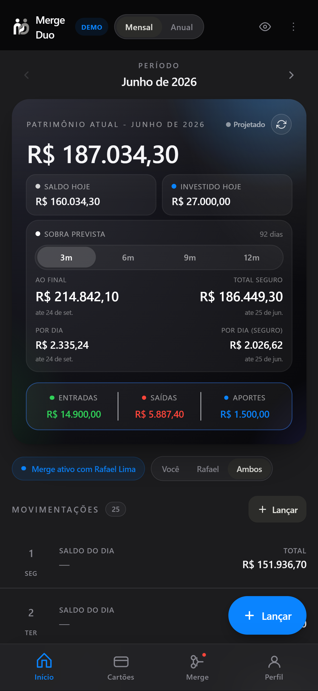
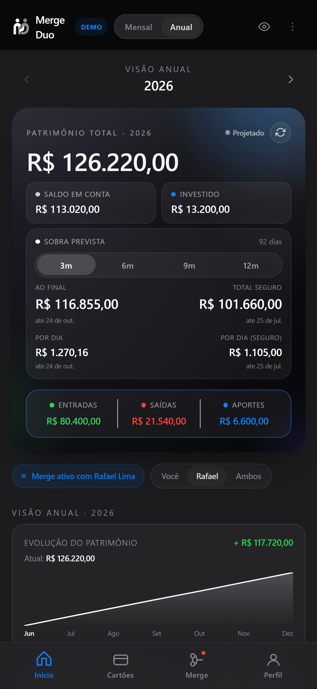
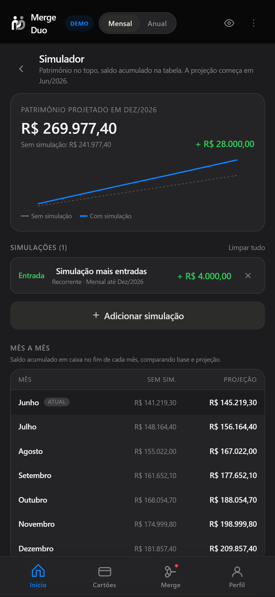

# MergeDuo


<!--
Após publicar no GitHub, substitua OWNER pelo seu usuário ou organização e
descomente para exibir o status do CI:
[](https://github.com/OWNER/MergeDuo/actions/workflows/ci.yml)
-->

MergeDuo é um projeto de portfólio para gestão financeira compartilhada. O app
combina lançamentos, cartões, regras fixas, agregados mensais/anuais e fluxo de
parceria entre usuários em uma arquitetura de microsserviços.

## Visão Geral

O repositório está organizado como monorepo:

```text
MergeDuo.React/          Frontend React, Vite, PWA e proxy same-origin
MergeDuo.Microservices/  APIs .NET 8, Scheduler e Copilot
MergeDuo.Terraform/      Infraestrutura Azure para Container Apps
logo/                    Ativos de marca
docs/                    Documentação de arquitetura e onboarding
```

Principais capacidades:

- Login Google com sessão first-party.
- Perfil, avatar, handle público e estatísticas.
- Parceria financeira com convites, aceite, pausa e encerramento.
- Lançamentos, tags, parcelas, cartões e faturas.
- Regras fixas materializadas pelo Scheduler.
- Agregados mensais/anuais usados como fonte primária para a UI.
- Copilot financeiro com endpoints para resumo e simulação.

## Demonstração

> Demo ao vivo: _adicione a URL pública após o deploy (ex.:
> `https://mergeduo.example.com`)._

Veja o passo a passo completo de cada tela em
**[docs/funcionalidades.md](docs/funcionalidades.md)** — com o intuito de cada
página, o que dá para fazer e as limitações. Abaixo, alguns destaques:

<p align="center">
  
  
  
</p>

<p align="center">
  <em>Painel mensal &middot; Visão anual &middot; Simulador</em>
</p>

## Stack

- Frontend: React 19, TypeScript, Vite, Vitest, Testing Library, Tailwind CSS e
  PWA.
- Backend: .NET 8 Minimal APIs, xUnit, Cosmos DB, Azure Blob Storage, JWT/JWKS e
  rate limiting.
- Infra: Terraform, Azure Container Apps, Azure Container Registry, Cosmos DB,
  Storage Account, Log Analytics, Key Vault e GitHub Actions OIDC.
- Deploy: imagens Docker por serviço e workflows manuais protegidos pelo
  ambiente GitHub `production`.

## Arquitetura

O frontend roda como Azure Container App e serve o bundle React. Em produção, o
`MergeDuo.React/server.js` encaminha `/auth`, `/users`, `/.well-known` e
`/api/*` para as APIs, mantendo chamadas same-origin para o navegador.

Leia a documentação completa em [docs/architecture.md](docs/architecture.md).

## Rodar Localmente

Pré-requisitos:

- Node.js 22.x
- .NET SDK 8.x
- Terraform 1.7+
- Docker, opcional para imagens locais
- Azure CLI, apenas para deploy/infra

Frontend:

```powershell
cd MergeDuo.React
npm install
Copy-Item .env.example .env.local
npm run dev
```

APIs:

```powershell
dotnet run --project MergeDuo.Microservices/MergeDuo.Identity/src/MergeDuo.Identity.Api
dotnet run --project MergeDuo.Microservices/MergeDuo.Transactions/src/MergeDuo.Transactions.Api
```

Cada microsserviço tem seu README com endpoints, configuração e comandos. O guia
de onboarding está em [docs/local-development.md](docs/local-development.md).

## Validação

Comandos usados para manter o projeto publicável:

```powershell
cd MergeDuo.React
npm run lint
npm run test
npm run build

cd ../MergeDuo.Terraform
terraform fmt -check -recursive
terraform validate

cd ..
Get-ChildItem MergeDuo.Microservices -Filter *.sln -Recurse |
  ForEach-Object { dotnet test $_.FullName --configuration Release }
```

O workflow `.github/workflows/ci.yml` executa esses checks no GitHub.

## Segredos e Configuração

Arquivos locais sensíveis não devem ser versionados:

- `MergeDuo.React/.env.local`
- `MergeDuo.Terraform/terraform.tfvars`
- `MergeDuo.Terraform/terraform.tfstate*`
- qualquer `.env`, chave privada, certificado ou `secrets.json`

Os `appsettings*.json` versionados contêm apenas placeholders. Em runtime, use
variáveis de ambiente no formato ASP.NET Core:

```text
Cosmos__ConnectionString
Jwt__PrivateKeyPem
RefreshTokens__Pepper
Transactions__ContinuationTokenSecret
BlobStorage__ConnectionString
```

O segredo compartilhado do Scheduler usa nomes diferentes em cada processo:
`TransactionsService__InternalKey` no Scheduler e
`InternalApi__SchedulerKey` no Transactions.

Se algum segredo real já tiver sido publicado antes, rotacione-o e remova-o do
histórico Git antes de tornar o repositório público.

## Deploy

O Terraform cria a base de infraestrutura Azure. Os workflows de deploy são
manuais e usam GitHub Environment `production` com OIDC:

Secrets:

```text
AZURE_CLIENT_ID
AZURE_TENANT_ID
AZURE_SUBSCRIPTION_ID
```

Vars compartilhadas:

```text
ACR_NAME
ACR_LOGIN_SERVER
AZURE_RESOURCE_GROUP
```

Vars do React:

```text
WEB_ACA_NAME
WEB_IMAGE_REPOSITORY
VITE_GOOGLE_CLIENT_ID
```

Veja detalhes em [MergeDuo.Terraform/README.md](MergeDuo.Terraform/README.md).
Mantenha os deploys manuais até configurar todas as variáveis e secrets de
runtime nos Container Apps. O procedimento sem Key Vault está em
[docs/azure-runtime-configuration.md](docs/azure-runtime-configuration.md).

## Desenvolvimento com IA

Este projeto foi desenvolvido com o apoio de ferramentas de inteligência
artificial, usadas apenas como auxílio à implementação. As **tecnologias e a arquitetura não foram escolhidas nem criadas por IA** — essas
decisões foram exclusivamente humanas.

Em todas as etapas, o código e a documentação passaram por validação,
verificação de acurácia, correções e análise humana para assegurar a qualidade, a coerência e a confiabilidade do resultado final.

## Licença

Este repositório não adota uma licença open source tradicional: o código é
**source-available** (aberto para leitura) e publicado como material de
portfólio. Você pode **clonar, compilar, executar localmente e rodar os testes**
para fins de avaliação, estudo e testes pessoais.

Uso comercial ou em produção, redistribuição, publicação e trabalhos derivados
dependem de autorização prévia e por escrito. Consulte o arquivo
[LICENSE](LICENSE) para os termos completos.
