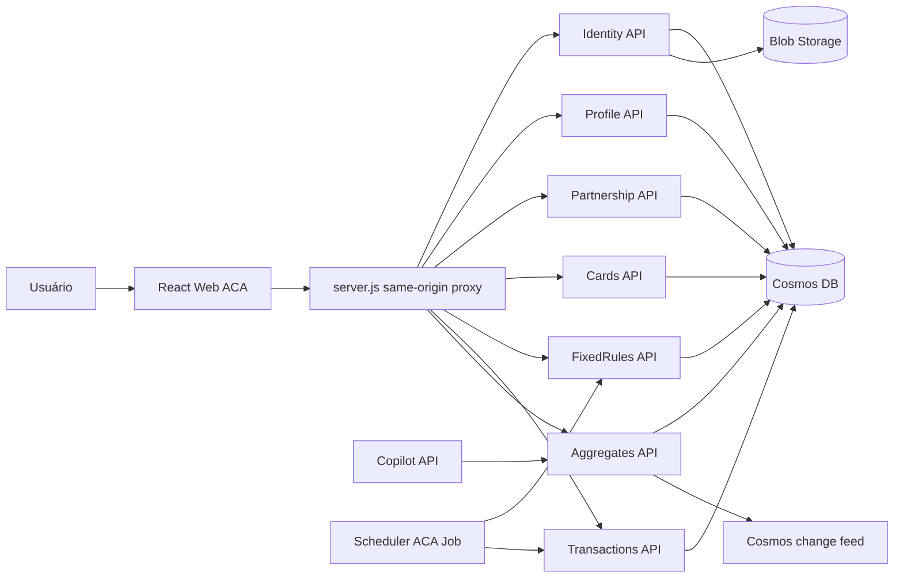

# Arquitetura do MergeDuo

## Objetivo

O MergeDuo foi desenhado como um monorepo de portfólio com frontend PWA, APIs
.NET independentes e infraestrutura reproduzível em Azure Container Apps. A
topologia prioriza clareza, baixo custo e separação de responsabilidades.

## Diagrama

## Componentes

- `MergeDuo.React`: PWA React/Vite. Em produção, chama rotas same-origin para
  evitar problemas de cookies cross-site em navegadores mobile.
- `MergeDuo.Identity`: login Google, refresh token, JWKS, perfil autenticado e
  avatar.
- `MergeDuo.Profile`: leitura de perfis, handles e estatísticas.
- `MergeDuo.Partnership`: convites e ciclo de vida da parceria.
- `MergeDuo.Cards`: cartões, remoção lógica e consulta de uso/fatura.
- `MergeDuo.FixedRules`: regras recorrentes e preview de ocorrências.
- `MergeDuo.Transactions`: lançamentos, parcelas, tags, grupos e endpoint
  interno para o Scheduler.
- `MergeDuo.Aggregates`: agregados mensais/anuais e recomputação por change
  feed.
- `MergeDuo.Scheduler`: job que materializa regras fixas em transações.
- `MergeDuo.Copilot`: endpoints de leitura/simulação para consumo por copilots
  externos.

## Fluxos Principais

- Autenticação: o frontend inicia Google Identity Services, o Identity valida o
  token Google, emite access token JWT e cookie de refresh first-party.
- Leitura da UI: o React carrega dados por `/api/*`; o proxy encaminha para as
  APIs corretas; `Aggregates` é usado como fonte primária para resumos.
- Regras fixas: `Scheduler` consulta regras vencidas, chama `Transactions` com
  chave interna e atualiza checkpoint após sucesso.
- Agregação: `Aggregates` recalcula visões mensais/anuais a partir de
  transações, parcerias, cartões e regras fixas.

## Segurança e Configuração

- Segredos reais não ficam versionados. `appsettings*.json` contém apenas
  placeholders e valores não sensíveis.
- Runtime deve usar variáveis de ambiente ASP.NET Core, por exemplo
  `Cosmos__ConnectionString`, `Jwt__PrivateKeyPem`,
  `RefreshTokens__Pepper`, `Transactions__ContinuationTokenSecret`,
  `BlobStorage__ConnectionString`, `TransactionsService__InternalKey` no
  Scheduler e `InternalApi__SchedulerKey` no Transactions.
- GitHub Actions usa OIDC com `AZURE_CLIENT_ID`, `AZURE_TENANT_ID` e
  `AZURE_SUBSCRIPTION_ID`; não há client secret no pipeline.

## Deploy

Cada API e job tem Dockerfile próprio. O workflow compartilhado
`_deploy-container-app.yml` restaura, testa, cria imagem, publica no ACR e
atualiza o Container App ou Job. O React possui workflow dedicado porque precisa
embutir variáveis `VITE_*` no build. Os workflows de deploy são iniciados
manualmente; apenas o CI roda automaticamente em push e pull request.

## Limites Intencionais

Esta versão é uma topologia de portfólio de baixo custo:

- Container Apps em Consumption.
- Cosmos DB serverless com acesso público.
- Sem API Management, Front Door, WAF ou VNet privada.
- Key Vault já existe na infra, mas a integração completa via secret references
  fica como melhoria futura.
