# Funcionalidades e Telas

Guia visual do **MergeDuo**, um app de gestão financeira compartilhada
mobile-first (PWA). Cada seção mostra uma tela real do aplicativo e explica o
**intuito da página**, **o que dá para fazer** e as **limitações**.

> As capturas foram feitas no **modo demonstração** (selo `DEMO`). Nesse modo,
> convites, parceria (Merge) e dados financeiros são simulados localmente no
> navegador, sem sair do dispositivo. As funcionalidades de tela, porém, são as
> mesmas da experiência real.

## Como navegar

- **Barra inferior**: alterna entre as quatro áreas principais — **Início**,
  **Cartões**, **Merge** e **Perfil**.
- **Cabeçalho**: logo do app, selo `DEMO`, alternador **Mensal / Anual**, ícone
  de **olho** (oculta/mostra valores) e o menu **⋮**, que dá acesso a
  **Lançamentos fixos**, **Tags**, **Simulador**, **Modo escuro** e **Sair**.
- **Botão flutuante “+ Lançar”**: cria um novo lançamento a partir de qualquer
  ponto do painel.
- Um **ponto vermelho** sobre o ícone *Merge* na barra inferior indica que há um
  convite pendente.

---

## 1. Login

  

**Intuito.** Ponto de entrada do app. A autenticação é feita com a conta Google
e o app mantém uma sessão própria (first-party).

**O que dá para fazer**

- Entrar com **Continuar com o Google**.
- Marcar **Entrar direto neste dispositivo** para manter a sessão e pular o login
  nas próximas vezes.
- Abrir **Mostrar diagnóstico** para inspecionar problemas de conexão/sessão.

**Limitações**

- Não há cadastro com usuário e senha — o acesso é exclusivamente via Google.
- Em modo demonstração a sessão é local; nenhum dado é compartilhado fora do
  navegador.

---

## 2. Início — Painel mensal

  

**Intuito.** É a visão central do mês. Reúne, de cima para baixo: patrimônio,
saldos, sobra prevista, totais do período e a lista diária de movimentações.

**O que dá para fazer**

- Navegar entre os meses no seletor de **período**.
- Ver o **Patrimônio total** do mês (com selo **Projetado** em meses futuros) e
  **atualizar** o cálculo.
- Consultar **Saldo em conta** e **Investido**.
- Ler a **Sobra prevista** em janelas de **3, 6, 9 ou 12 meses**, com os recortes
  **Ao final** e **Total seguro**, além do valor **por dia** e **por dia
  (seguro)**.
- Ver os totais de **Entradas**, **Saídas** e **Aportes** do período.
- Alternar entre **Mensal** e **Anual**, ocultar valores e abrir o
  **+ Lançar**.

**Limitações**

- Em meses futuros os números são **projeções/estimativas** (selo *Projetado*),
  não lançamentos confirmados.
- A “sobra segura” aplica uma margem de segurança — por isso costuma ser menor
  que a sobra “ao final”.

---

## 3. Lista diária e dia selecionado

  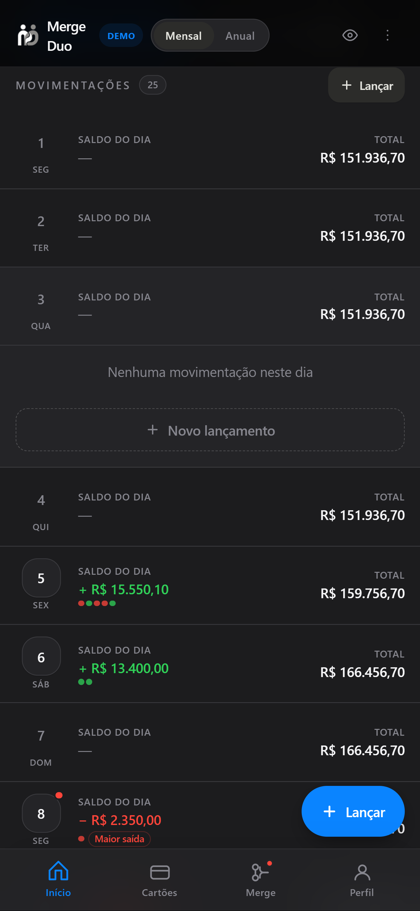

**Intuito.** A lista do mês mostra o saldo dia a dia e destaca marcadores
importantes. Selecionar um dia foca nele.

**O que dá para fazer**

- Rolar dia a dia vendo **Saldo do dia** e o **Total** acumulado.
- Identificar **marcadores** (pontos coloridos) que sinalizam movimentações.
- Abrir um dia **sem movimentações** e criar ali mesmo com **+ Novo lançamento**.
- Reconhecer destaques como o selo **Maior saída**.

**Limitações**

- Dias futuros exibem o total com o prefixo **~** (aproximado), por serem
  projeção.

---

## 4. Dia com lançamentos

  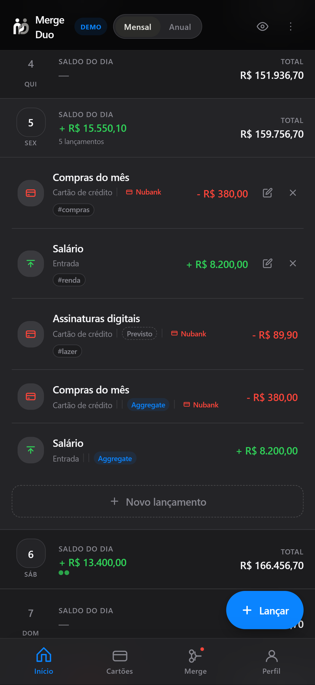

**Intuito.** Detalhar todas as movimentações de um dia específico.

**O que dá para fazer**

- Ver cada lançamento com **categoria** (Entrada, Cartão de crédito, Empréstimo,
  Gasto fixo, Saída, Aporte), **cartão** vinculado, **tags** e **valor**
  (verde para entradas, vermelho para saídas).
- Distinguir lançamentos reais dos selos **Previsto** (gerado por regra fixa) e
  **Aggregate** (consolidado).
- **Editar** ou **excluir** um lançamento.
- Adicionar um novo lançamento direto no dia.

**Limitações**

- Itens marcados como **Previsto/Aggregate** vêm de regras fixas e agregados; o
  ajuste é feito na origem (regra/lançamento) e não item a item da projeção.

---

## 5. Registrar um lançamento

  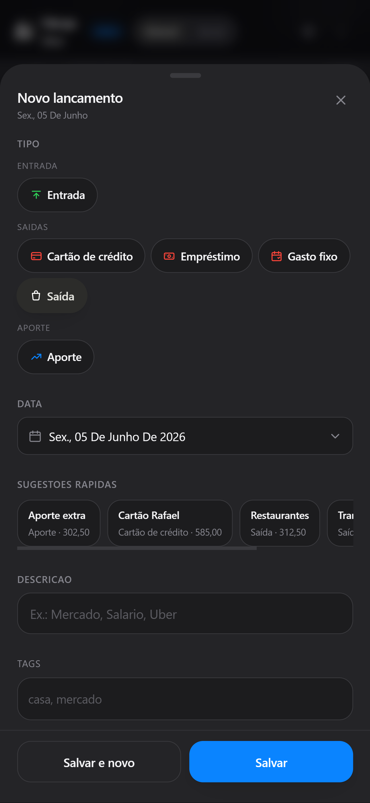
  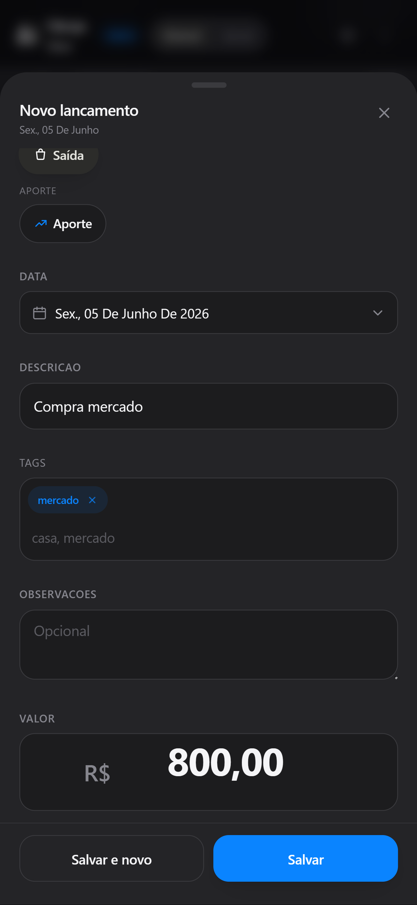

**Intuito.** Criar uma movimentação. O formulário abre como uma folha inferior
sobre o painel.

**O que dá para fazer**

- Escolher o **tipo**: **Entrada**, **Saída** (Cartão de crédito, Empréstimo,
  Gasto fixo ou Saída) ou **Aporte**.
- Definir a **data** do lançamento.
- Usar **sugestões rápidas** para reaproveitar descrições recorrentes.
- Preencher **descrição**, **tags**, **observações** e **valor**.
- Salvar com **Salvar** ou registrar vários em sequência com **Salvar e novo**.

**Limitações**

- O tipo determina a categoria e a cor; lançamentos de cartão exigem um cartão
  cadastrado para entrarem na fatura correta.

---

## 6. Filtro do Merge no painel

  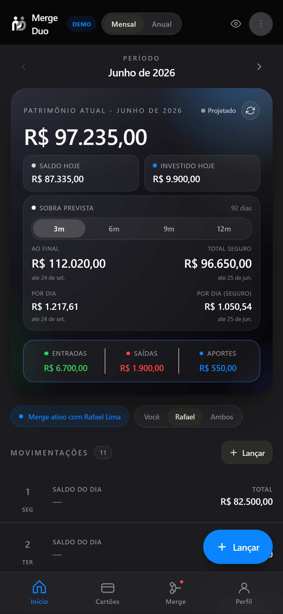
  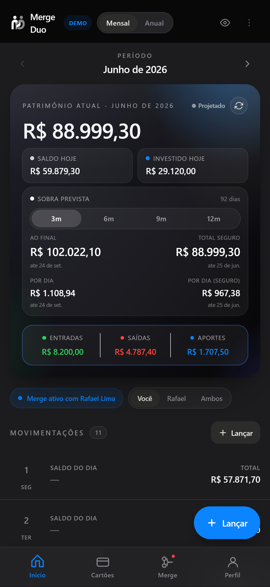

**Intuito.** Com o Merge ativo, alternar a visão financeira entre **Você**, o
**parceiro** e **Ambos** (a soma dos dois).

**O que dá para fazer**

- Filtrar **todos** os números do painel (patrimônio, saldos, totais e lista) por
  titular.
- Comparar rapidamente a sua situação, a do parceiro e a combinada.

**Limitações**

- O filtro só aparece quando há um **Merge ativo**; sem parceria, a visão é
  individual.

---

## 7. Avançar no tempo e projeção

  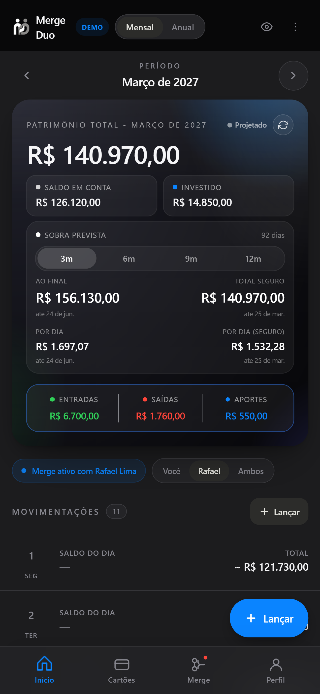

**Intuito.** Avançar para meses futuros e enxergar como o patrimônio evolui com
base nas regras fixas e movimentações já conhecidas.

**O que dá para fazer**

- Navegar para frente/trás no seletor de período.
- Ver o patrimônio e os saldos **projetados** do mês escolhido.
- Acompanhar a lista diária com totais aproximados (**~**).

**Limitações**

- Quanto mais distante o mês, mais o resultado depende de projeção (regras fixas
  e tendências), não de dados confirmados.

---

## 8. Visão Anual

  
  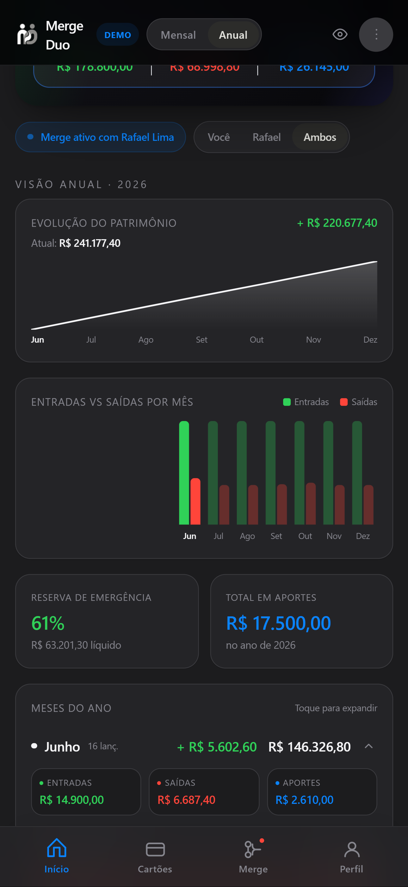

  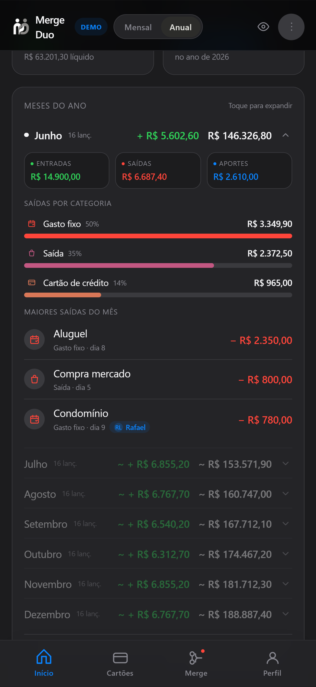
  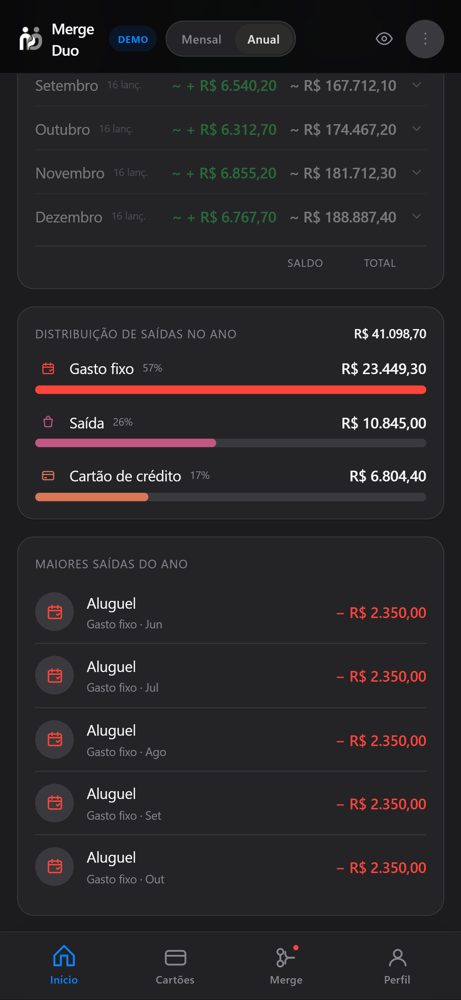

**Intuito.** Consolidar o ano inteiro em gráficos e listas, para leitura de
tendências e de onde o dinheiro está indo.

**O que dá para fazer**

- Ver o **Patrimônio total do ano** e os saldos.
- Acompanhar a **Evolução do patrimônio** (gráfico de linha).
- Comparar **Entradas vs Saídas por mês** (gráfico de barras).
- Ler indicadores de **Reserva de emergência** e **Total em aportes**.
- Expandir **Meses do ano** para ver, por mês, **saídas por categoria** e as
  **maiores saídas** (com atribuição ao titular no Merge).
- Ver a **Distribuição de saídas no ano** e as **Maiores saídas do ano**.

**Limitações**

- Meses futuros aparecem com valores projetados (**~**).
- É uma visão analítica/consolidada — os lançamentos são editados na visão
  mensal.

---

## 9. Modo privacidade (ocultar valores)

  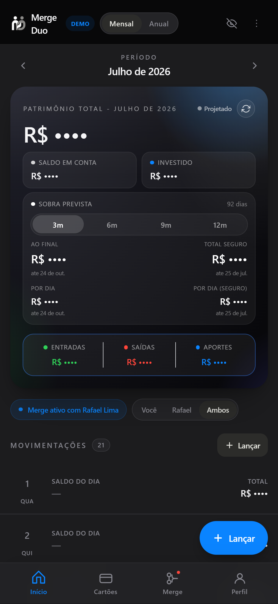

**Intuito.** Permitir usar o app em público sem expor montantes.

**O que dá para fazer**

- Tocar no ícone de **olho** no cabeçalho para mascarar todos os valores como
  `R$ ••••` (os totais do dia viram `—`).
- Tocar novamente para revelar.

**Limitações**

- É uma proteção **apenas visual**: oculta na tela, mas não bloqueia o app com
  senha nem criptografa nada adicional.

---

## 10. Cartões

  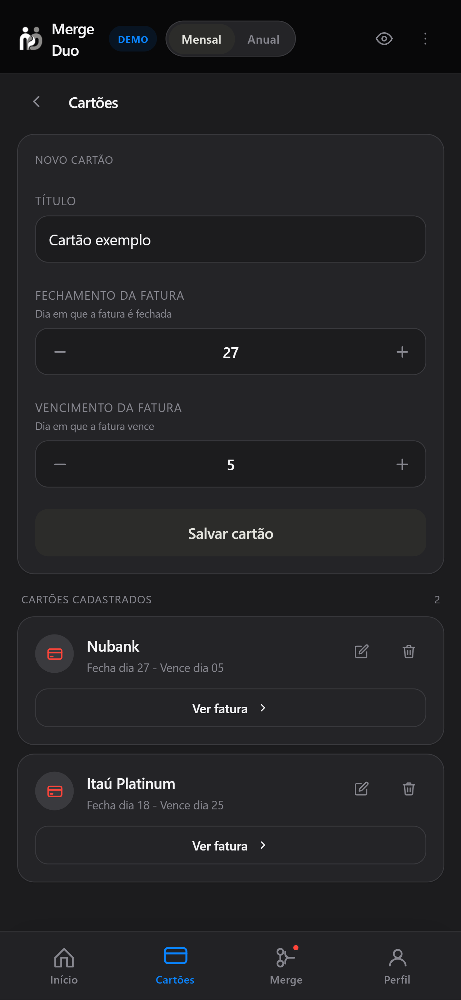

**Intuito.** Cadastrar os cartões de crédito e seus ciclos de fatura.

**O que dá para fazer**

- Criar um cartão informando **título**, **dia de fechamento** e **dia de
  vencimento** da fatura.
- **Editar** ou **excluir** cartões já cadastrados.
- Abrir **Ver fatura** para o detalhamento mensal.

**Limitações**

- Fechamento e vencimento são definidos por **dia do mês**.
- Para um lançamento entrar na fatura, ele precisa ser do tipo **Cartão de
  crédito** e estar vinculado ao cartão.

---

## 11. Fatura do cartão

  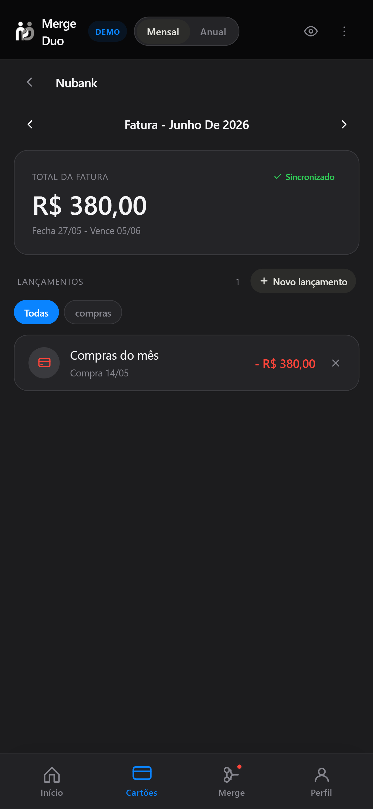

**Intuito.** Mostrar a fatura mensal de um cartão, com o total e os lançamentos
que a compõem.

**O que dá para fazer**

- Navegar por **mês** da fatura.
- Ver o **total**, a **janela de compras** (de/até) e a **data de vencimento**.
- Listar os lançamentos da fatura, com data, titular, tags e valor.

**Limitações**

- A fatura é montada por **cálculo local** (no cliente), indicado pelo selo
  **Cálculo local**.

---

## 12. Merge — parceria financeira

  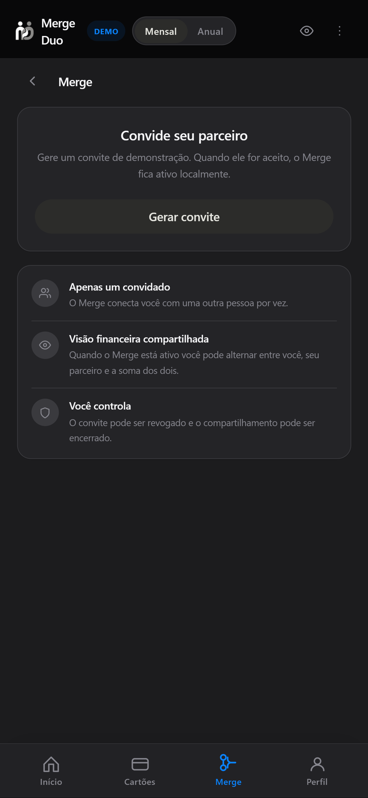
  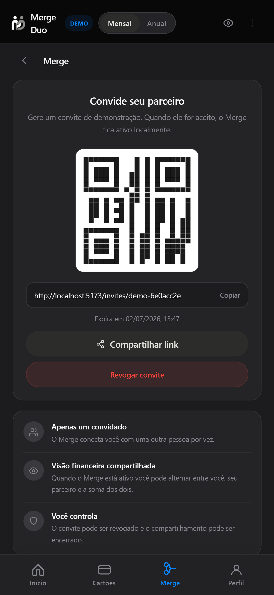
  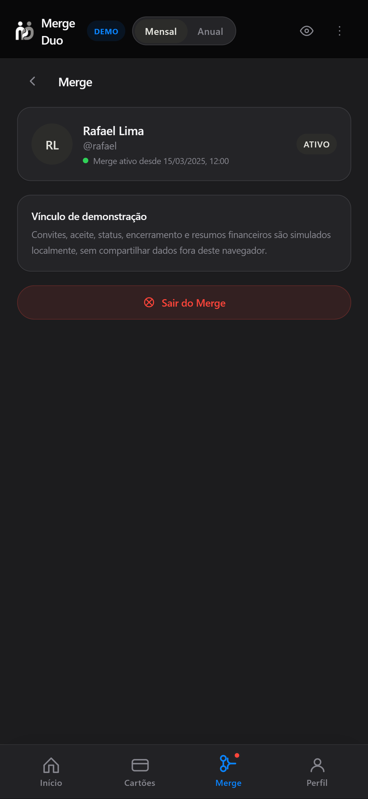

**Intuito.** Conectar a sua conta à de **uma** outra pessoa para obter uma visão
financeira compartilhada.

**O que dá para fazer**

- **Gerar um convite** com **QR Code** e **link** (com data de expiração),
  podendo **copiar**, **compartilhar** ou **revogar**.
- Quando o convite é aceito, o **Merge fica ativo**: aparece o parceiro, o status
  **ATIVO** e desde quando.
- Alternar a visão entre **você / parceiro / ambos** no painel.
- **Encerrar** a parceria com **Sair do Merge**.

**Limitações**

- **Apenas um parceiro por vez** — o Merge conecta você a uma pessoa.
- O convite **expira** e pode ser revogado.
- Em modo demonstração todo o fluxo (convite, aceite, status, encerramento e
  resumos) é **simulado localmente**, sem compartilhar dados fora do navegador.

---

## 13. Perfil

  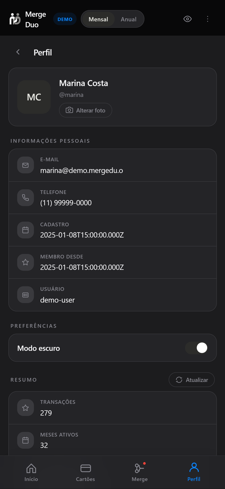

**Intuito.** Reunir os dados da conta, as preferências e um resumo de uso.

**O que dá para fazer**

- Ver nome e handle público e **alterar a foto**.
- Consultar **informações pessoais**: e-mail, telefone, datas de cadastro/membro
  e identificador de usuário.
- Ativar/desativar o **Modo escuro**.
- Ver o **Resumo** (transações e meses ativos) e **atualizar** as estatísticas.

**Limitações**

- O resumo pode aparecer como **“Ainda não calculado”** até a primeira
  atualização.

---

## 14. Menu de navegação

  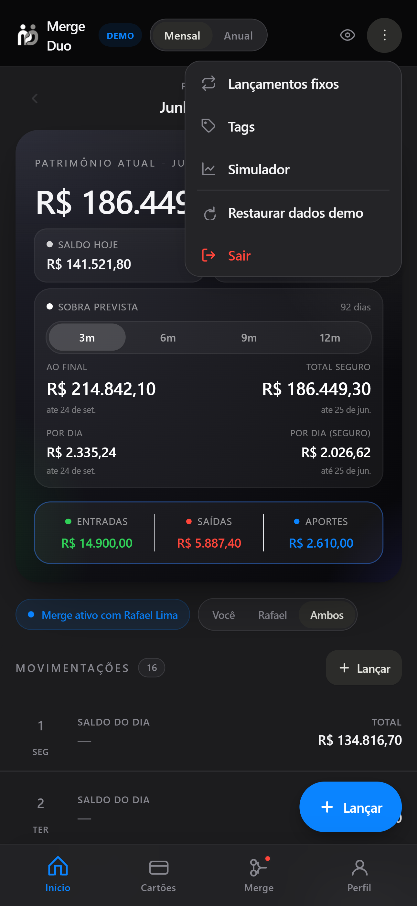

**Intuito.** Dar acesso às áreas secundárias que não ficam na barra inferior.

**O que dá para fazer**

- Abrir **Lançamentos fixos**, **Tags** e **Simulador**.
- Alternar o **Modo escuro**.
- **Sair** da conta.

---

## 15. Lançamentos fixos (regras recorrentes)

  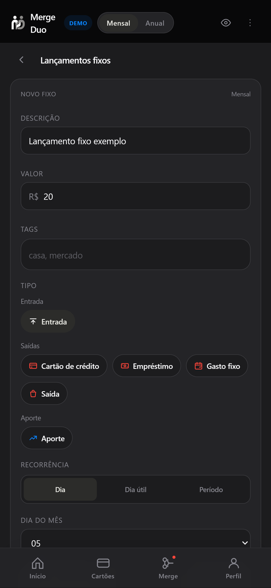
  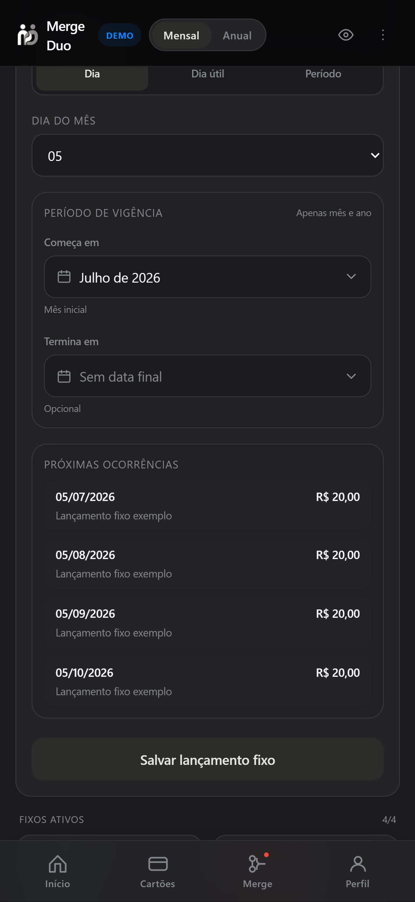
  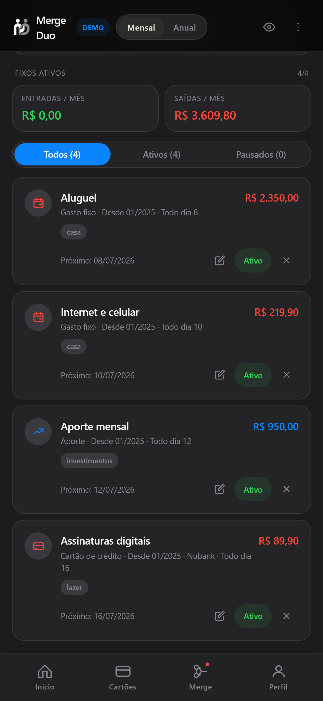

**Intuito.** Cadastrar regras recorrentes (aluguel, salário, assinaturas, aportes
etc.) que o sistema **materializa** automaticamente nos meses.

**O que dá para fazer**

- Criar uma regra com **descrição**, **valor**, **tags** e **tipo** (Entrada,
  Cartão de crédito, Empréstimo, Gasto fixo, Saída ou Aporte).
- Definir a **recorrência**: **Dia** (dia fixo do mês), **Dia útil** ou
  **Período**.
- Definir o **período de vigência**: mês inicial e, opcionalmente, mês final
  (**Sem data final**).
- Conferir a **prévia** em **Próximas ocorrências** antes de salvar.
- Ver os **fixos ativos** com os totais de **entradas/saídas por mês** e
  filtrar por **Todos / Ativos / Pausados**.
- **Pausar/reativar** (botão *Ativo*), **editar** ou **excluir** cada regra, com
  a indicação da **próxima** ocorrência.

**Limitações**

- A vigência é controlada por **mês e ano**.
- Regras pausadas deixam de materializar movimentações até serem reativadas.

---

## 16. Tags

  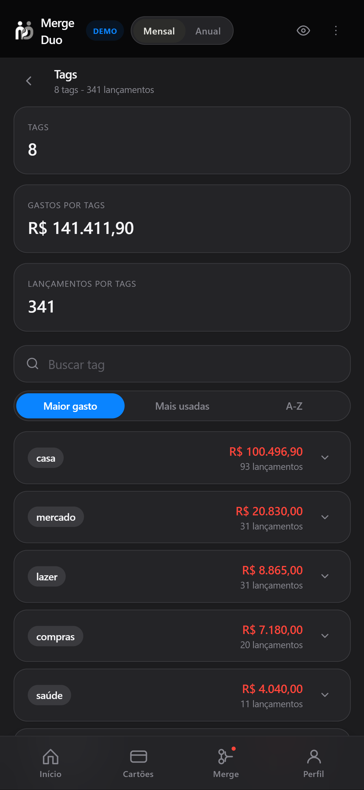
  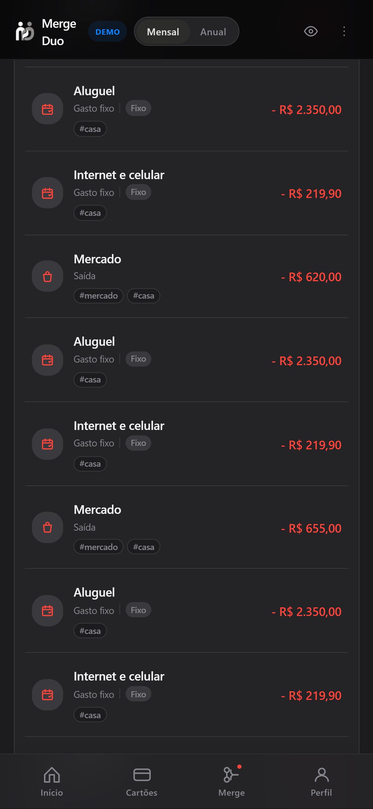

**Intuito.** Analisar os gastos agrupados por **tag**.

**O que dá para fazer**

- Ver o total de **tags**, o **gasto por tags** e o número de **lançamentos por
  tags**.
- **Buscar** uma tag.
- **Ordenar** por **Maior gasto**, **Mais usadas** ou **A-Z**.
- **Expandir** cada tag para ver o valor e a quantidade de lançamentos.

**Limitações**

- As tags são uma camada de **classificação/análise**; elas não alteram o tipo
  nem a categoria do lançamento.

---

## 17. Simulador

  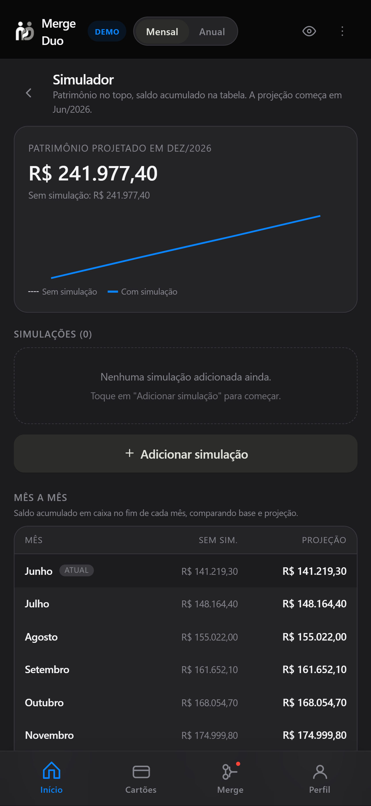
  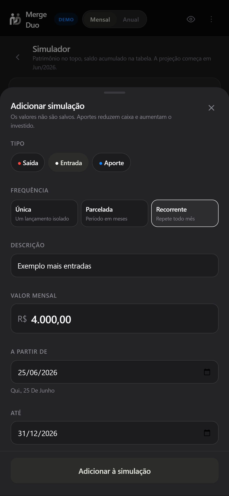

  
  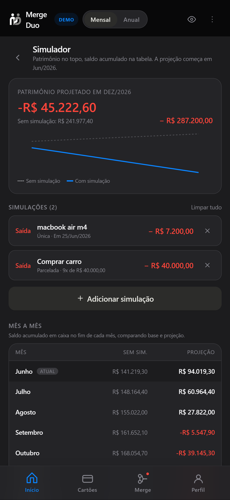

**Intuito.** Testar cenários **“e se”** sobre o patrimônio, sem alterar os dados
reais. Mostra o patrimônio no topo e o saldo acumulado mês a mês na tabela.

**O que dá para fazer**

- Ver o **patrimônio projetado** no fim do período e comparar **Sem simulação**
  (base) com **Com simulação** (gráfico e tabela **mês a mês**).
- **Adicionar simulações** escolhendo **tipo** (Saída, Entrada ou Aporte),
  **frequência** (**Única**, **Parcelada** ou **Recorrente**), **valor** e
  **período** (a partir de / até).
- Ver o **impacto** de cada cenário: uma entrada/aporte **eleva** a projeção
  (delta verde) e uma saída a **reduz** (delta vermelho).
- **Remover** uma simulação ou usar **Limpar tudo**.

**Limitações**

- Os valores **não são salvos** — é uma projeção temporária para comparação.
- Aportes simulados **reduzem o caixa** e **aumentam o investido**, refletindo o
  comportamento real desse tipo de movimento.

---

## Resumo das telas

| # | Tela | Acesso |
|---|------|--------|
| 1 | Login | Entrada do app |
| 2–8 | Painel mensal, lista diária, lançamentos, filtros e projeção | **Início** |
| 8–9 | Visão anual e modo privacidade | **Início** (alternador Anual / olho) |
| 10–11 | Cartões e fatura | **Cartões** |
| 12 | Parceria (convite, ativo, encerrar) | **Merge** |
| 13 | Perfil e preferências | **Perfil** |
| 14 | Menu de navegação | Cabeçalho **⋮** |
| 15 | Lançamentos fixos | Menu **⋮** |
| 16 | Tags | Menu **⋮** |
| 17 | Simulador | Menu **⋮** |
